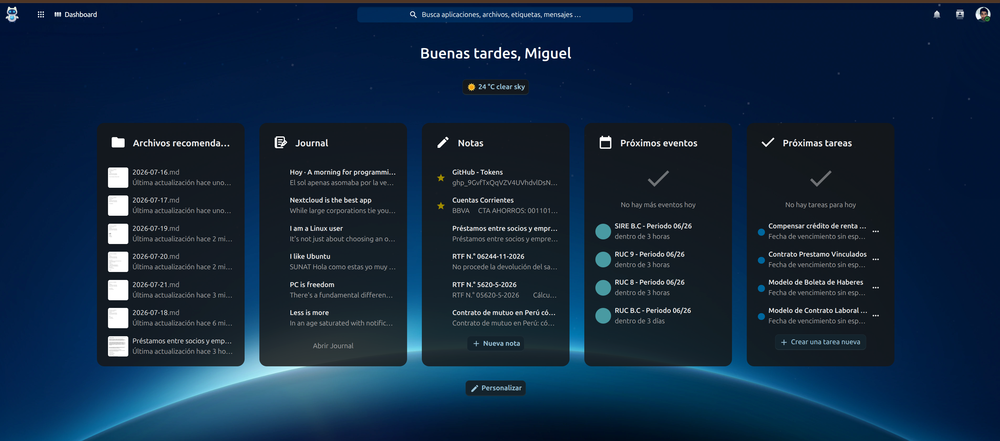
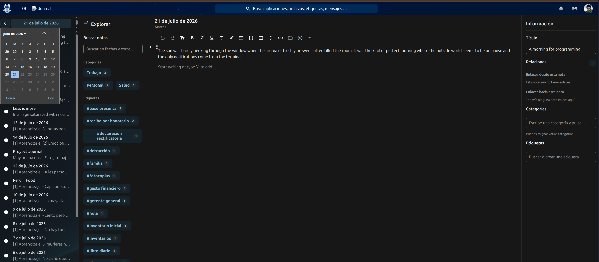

# Journal

Journal is a private daily journal and lightweight personal knowledge
workspace for Nextcloud.

Write one entry per day, organize your notes with categories and native
Nextcloud tags, connect ideas with wikilinks, and keep your content as
portable Markdown files inside your own Nextcloud storage.

## Highlights

- One journal entry per day
- Native Markdown storage
- YAML Front Matter metadata
- Rich-text editing powered by Nextcloud Text
- Multiple categories
- Native Nextcloud System Tags
- Full-text search
- Wikilinks and note relations
- Incoming and outgoing links
- Markdown export
- Individual and combined PDF export
- Native Nextcloud Dashboard widget
- Responsive desktop, tablet and mobile layout
- English, Spanish and German translations

## Screenshots

### Daily journal

Write and organize daily entries using the Nextcloud Text editor.


### Dashboard widget

Access your latest entries directly from the Nextcloud Dashboard.



### Editor and organization

Use the daily editor together with categories, tags and note relations.



### Search

Search entries by content, date, category, tag or wikilink.


### Categories and tags

Organize entries with multiple categories and native Nextcloud System Tags.


### Portable Markdown storage

Journal entries remain accessible as regular Markdown files in Nextcloud.


## Storage and privacy

Journal stores entries as regular Markdown files in the user's Nextcloud
storage.

Your notes remain under your control and continue to be accessible through
the Files application even when Journal is disabled.

Journal does not require an external service and does not send journal
content to third parties.

## Requirements

- Nextcloud 34
- PHP 8.2, 8.3, 8.4 or 8.5
- Nextcloud Text

## Installation

### Nextcloud App Store

Install Journal from the Apps section of your Nextcloud administration panel
when the public release becomes available.

### Manual installation

Download the release archive and extract it into the writable Nextcloud
applications directory:

```bash
cd /var/www/html/nextcloud/custom_apps
tar -xzf journalnotes-0.2.0.tar.gz
chown -R www-data:www-data journalnotes

cd /var/www/html/nextcloud
sudo -u www-data php occ app:enable journalnotes
```

The extracted application directory must be named:

```text
journalnotes
```

## First use

1. Open Journal from the Nextcloud application menu.
2. Select a date.
3. Start writing.
4. Optionally add a title, categories and tags.
5. Use `[[Note title]]` to connect entries.
6. Open the Dashboard to enable the Journal widget.

Journal saves changes automatically after a short pause in writing.

## Export

Journal supports:

- Markdown export
- Individual PDF export
- Combined PDF export

## Compatibility

Journal 0.2.0 is designed for:

- Nextcloud 34
- PHP 8.2–8.5

## Documentation

- [Release notes](https://github.com/cpcmisha/journal/blob/main/RELEASE.md)
- [Changelog](https://github.com/cpcmisha/journal/blob/main/CHANGELOG.md)
- [Roadmap](https://github.com/cpcmisha/journal/blob/main/ROADMAP.md)
- [Security policy](https://github.com/cpcmisha/journal/blob/main/SECURITY.md)

## Contributing

Bug reports, suggestions and pull requests are welcome.

Please use the issue tracker:

https://github.com/cpcmisha/journal/issues

## License

Journal is free and open-source software licensed under the
GNU Affero General Public License, version 3 or later.

See [COPYING](COPYING) for the complete license text.
