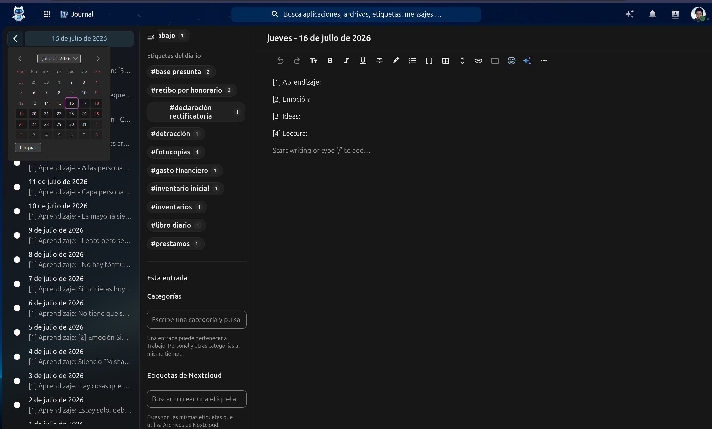
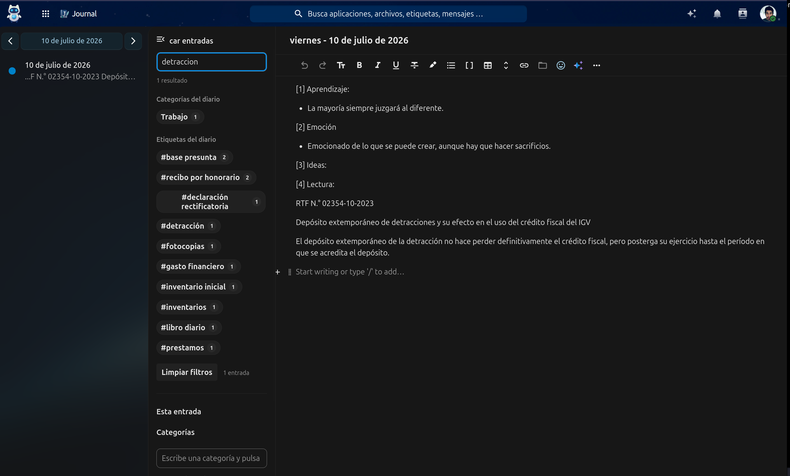
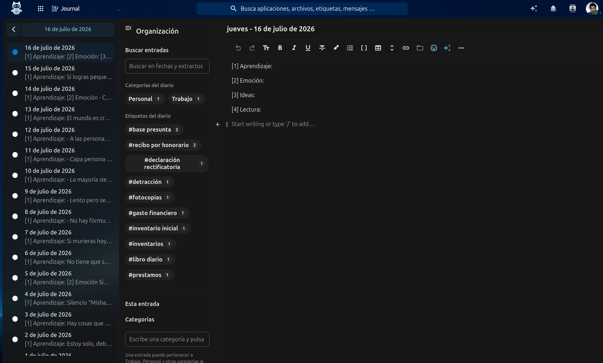
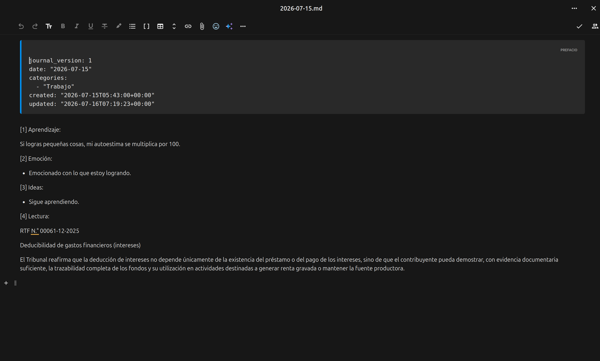

# Journal

<p align="center">
  
</p>

<h3 align="center">
A private Markdown journal and personal knowledge workspace for Nextcloud.
</h3>

<p align="center">
Write every day. Own your notes forever.
</p>

---

# Overview

Journal is an open-source Nextcloud application that combines a daily journal with a lightweight personal knowledge workspace.

Unlike traditional note-taking services, Journal stores every entry as a standard Markdown file inside your own Nextcloud storage.

Your notes remain portable, searchable and future-proof.

No proprietary database.

No vendor lock-in.

Your data always belongs to you.

---

# Why Journal?

Many note-taking applications lock your content inside proprietary databases.

Journal follows a different philosophy.

Every journal entry is simply a Markdown file.

That means you can:

- edit it from Nextcloud Files
- synchronize it with any Markdown editor
- back it up easily
- version it with Git
- keep access to your notes even if Journal is no longer installed

Journal is designed to become your private writing space while respecting the ownership of your information.

---

# Features

## Daily Journal

Create one journal entry for every day.

Journal automatically organizes entries by year and month.

Example:

```text
Journal/
└── 2026/
    └── 07/
        ├── 2026-07-01.md
        ├── 2026-07-02.md
        └── 2026-07-03.md
```

---

## Native Markdown Storage

Every entry is stored as a regular Markdown document.

Example:

```markdown
---
journal_version: 1
date: "2026-07-14"

categories:
  - Work
  - Ideas

created: "2026-07-14T08:15:00Z"
updated: "2026-07-14T09:40:00Z"
---

Today I worked on [[Journal App]].

#nextcloud
```

Your notes remain readable outside Journal.

---

## YAML Front Matter

Journal stores metadata using standard YAML Front Matter.

Supported fields include:

- journal_version
- date
- categories
- created
- updated

Future versions may include:

- mood
- location
- weather
- attachments

without breaking compatibility.

---

## Multiple Categories

Each entry may belong to multiple categories.

Examples:

- Work
- Personal
- Study
- Health
- Finance
- Ideas

Categories are stored directly inside the Markdown file.

---

## Native Nextcloud System Tags

Journal integrates with the Nextcloud System Tags API.

Tags assigned inside Journal are immediately available in:

- Files
- Search
- other compatible Nextcloud applications

No duplicated tag database is maintained.

---

## Full-text Search

Search includes:

- journal content
- dates
- categories
- Nextcloud tags
- wikilinks

Results are ranked by relevance.

---

## Wikilinks

Journal recognizes wiki-style links.

Example:

```text
[[Project Journal]]
```

Future versions will include:

- backlinks
- linked notes
- graph navigation

---

## Export

Entries can be exported as:

- Markdown
- PDF

No proprietary export format is required.

---

## Nextcloud Text Integration

Journal uses the official Nextcloud Text editor.

You keep the familiar editing experience while working with regular Markdown files.

---

## Internationalization

Journal currently includes:

- English
- Español
- Deutsch

Additional translations are welcome.

---

# Screenshots

## Main journal view



## Search



## Categories and Nextcloud tags



## Markdown storage



---
# Storage Philosophy

Journal was designed around a simple principle:

> Your notes should survive the application.

Even if Journal is removed, every entry remains available as a normal Markdown document inside Nextcloud Files.

This makes backups, synchronization and migration significantly easier.

---

# Architecture

```
Browser

      │

      ▼

Vue 3 Frontend

      │

      ▼

PHP Controllers

      │

      ▼

Journal Services

      │

      ▼

Markdown Files

      │

      ▼

Nextcloud Files
```

---

# Requirements

- Nextcloud 34
- PHP 8.0–8.3
- Nextcloud Text

---

# Installation

Clone the repository.

```bash
git clone https://github.com/cpcmisha/journal.git journalnotes
```

Install dependencies.

```bash
composer install
npm install
```

Compile frontend assets.

```bash
npm run build
```

Enable the application.

```bash
sudo -u www-data php occ app:enable journalnotes
```

---

# OCC Commands

Journal provides maintenance commands.

```bash
journalnotes:migrate-markdown
```

Migrates legacy database entries into Markdown files.

---

```bash
journalnotes:migrate-frontmatter
```

Adds YAML Front Matter to existing Markdown entries.

---

```bash
journalnotes:rename-root-folder
```

Renames the storage directory from

```
Journal
```

to

```
Journal
```

---

# Project Structure

```text
appinfo/
css/
docs/
img/
js/
l10n/
lib/
screenshots/
src/
templates/

README.md
CHANGELOG.md
NOTICE.md
```

---

# Documentation

Additional documentation is available in the `docs` directory.

- User Guide
- Administrator Guide
- Development Guide

---

# Roadmap

## Version 1

- Daily journal
- Markdown storage
- YAML Front Matter
- Categories
- Nextcloud Tags
- Search
- PDF export

---

## Version 2

- Backlinks
- Linked notes
- Favorites
- Templates
- Rich metadata

---

## Version 3

- Graph view
- Calendar view
- Tasks
- Daily reminders
- AI-assisted writing

---

# Contributing

Contributions are welcome.

Please read:

- CONTRIBUTING.md
- DEVELOPMENT.md

before opening a Pull Request.

---

# Compatibility

Journal is currently tested with:

- Nextcloud 34

Earlier versions are not officially supported.

---

# Privacy

Journal does not transmit journal content to external services.

All notes remain inside the user's own Nextcloud storage.

---

# License

Journal is released under the GNU Affero General Public License v3.0 or later.

See the COPYING file for details.

---

# Historical Origin

Journal originated from the open-source **Diary** project created by Daniel Röhrig.

Since then it has evolved into an independent application with:

- a new application ID
- a new PHP namespace
- a new database schema
- native Markdown storage
- YAML Front Matter
- Nextcloud System Tags integration
- advanced search
- multilingual support
- a redesigned architecture

Historical copyright notices remain documented in NOTICE.md.

---

# Author

**Miguel Torres (Misha)**

https://miguel.pe

GitHub:

https://github.com/cpcmisha

---

# Support the Project

If Journal helps you, consider:

- reporting bugs
- suggesting improvements
- contributing code
- improving translations
- sharing the project with the Nextcloud community

Every contribution helps make Journal better.
